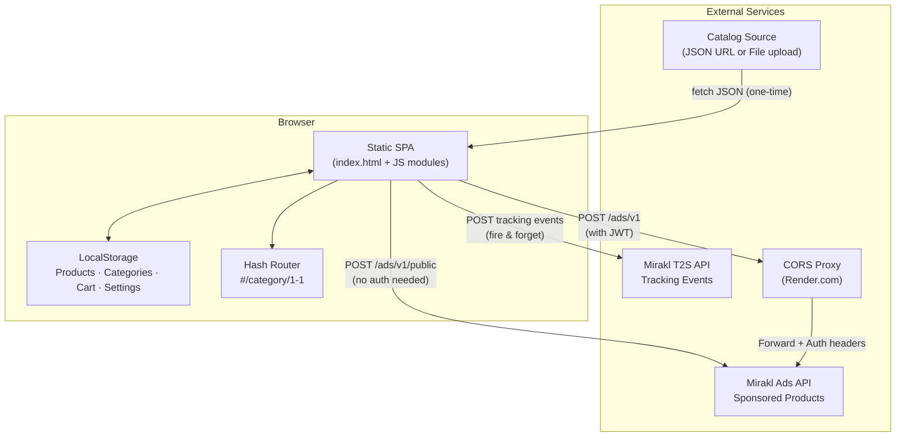
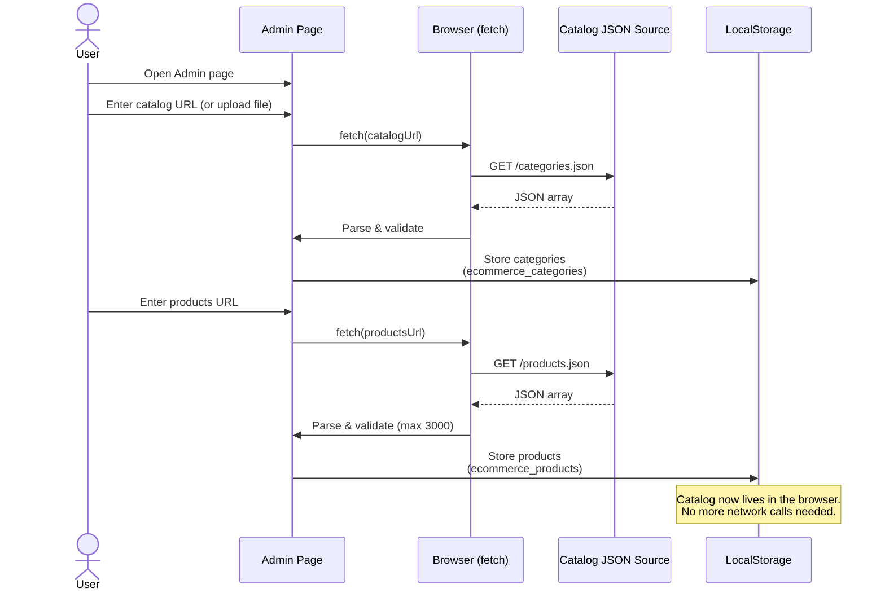
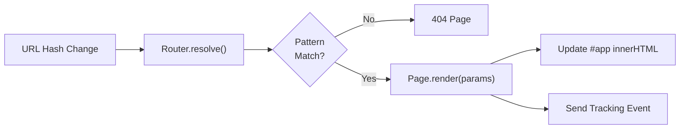
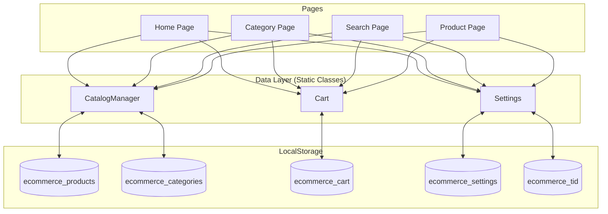
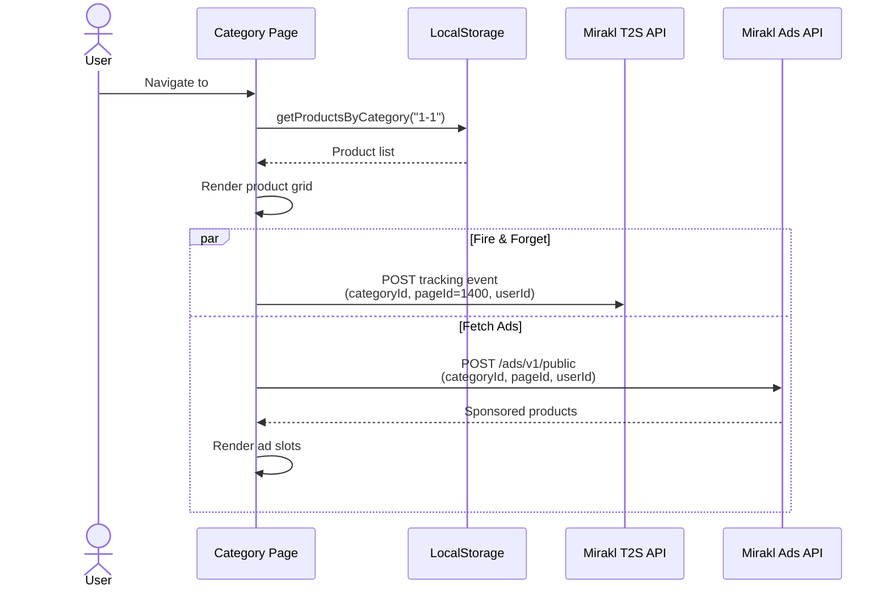
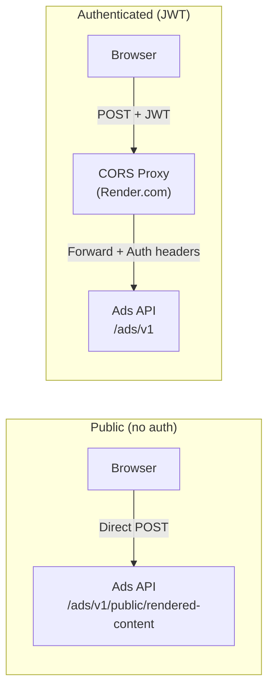
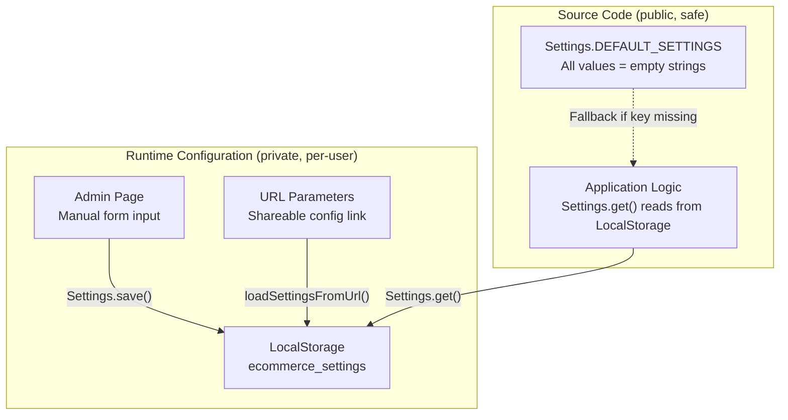

# How It Works — A Static Site With No Backend

This document explains the "magic" behind The Simple Catalog: a fully static e-commerce site that displays products, handles navigation, tracks user behavior, and serves ads — all without a backend server, a database, or a build step.

**Intended audience**: Anyone curious about the architecture, especially those wondering *"how does this work without a server?"*

---

## Table of Contents

- [The Big Picture](#the-big-picture)
- [How the Catalog Gets In](#how-the-catalog-gets-in)
- [SPA Routing — How Pages Work](#spa-routing--how-pages-work)
- [Data Flow — From LocalStorage to Screen](#data-flow--from-localstorage-to-screen)
- [Tracking & Ads Integration](#tracking--ads-integration)
- [The CORS Proxy — Why and How](#the-cors-proxy--why-and-how)
- [Settings Mechanism — Zero Secrets in Code](#settings-mechanism--zero-secrets-in-code)
- [Why It Works Without a Backend](#why-it-works-without-a-backend)

---

## The Big Picture

The application is a **pure static site**: one `index.html`, a few JS modules, one CSS file. No Node.js, no React, no Webpack, no server. You can open `index.html` directly in Chrome and it works.

The trick is simple: **the browser IS the server**. LocalStorage is the database, JavaScript modules are the application logic, and hash-based routing replaces server-side URL handling.



---

## How the Catalog Gets In

The catalog (products + categories) is imported **once** through the Admin page, then stored in LocalStorage. From that point on, every page reads data locally — no more network calls for catalog data.

Two import methods are available:
- **File upload**: select a local `.json` file
- **URL fetch**: enter a URL, the browser fetches it with `fetch()`



Once imported, the catalog **persists across sessions** — close the browser, come back tomorrow, the data is still there. The only way to lose it is to clear browser data or reimport.

---

## SPA Routing — How Pages Work

Navigation uses **hash-based routing** (`#/category/1-1`, `#/search?q=book`). The browser never reloads the page — the Router listens for `hashchange` events and swaps the content of the `#app` container.

Available routes:

| Route | Page | Example |
|-------|------|---------|
| `#/` | Homepage | `#/` |
| `#/category/:id` | Category listing | `#/category/1-1` |
| `#/product/:id` | Product detail | `#/product/4123018513199-0` |
| `#/search` | Search results | `#/search?q=book` |
| `#/cart` | Shopping cart | `#/cart` |
| `#/checkout` | Checkout form | `#/checkout` |
| `#/order-confirmation` | Order confirmation | `#/order-confirmation` |
| `#/admin` | Admin & Settings | `#/admin` |



Each page is an ES6 class with a static `render()` method. The router calls it with extracted params, the page reads data from LocalStorage via `CatalogManager`, builds HTML, and injects it into the DOM.

---

## Data Flow — From LocalStorage to Screen

**`CatalogManager`** is the single access point for all catalog data. Every page reads through it — never directly from LocalStorage.



### LocalStorage Keys

| Key | Content | Size |
|-----|---------|------|
| `ecommerce_products` | Full product catalog | Up to 3000 items |
| `ecommerce_categories` | Category tree hierarchy | ~700 categories |
| `ecommerce_settings` | Site config (URLs, IDs, page IDs) | Small JSON |
| `ecommerce_cart` | Shopping cart items | Variable |
| `ecommerce_tid` | User tracking UUID | 36 chars |

---

## Tracking & Ads Integration

When a user navigates to a page (category, product, search), two things happen **in parallel**:

1. **Tracking event** is sent to the Mirakl T2S API (fire-and-forget)
2. **Sponsored products** are requested from the Mirakl Ads API



Tracking is **fire-and-forget**: the page doesn't wait for a response. If the API is down or unconfigured, the page still works perfectly — users see their products regardless.

---

## The CORS Proxy — Why and How

The Mirakl Ads API has two endpoints:

- **Public** (`/ads/v1/public/rendered-content`): no authentication needed, no CORS issues — the browser calls it directly.
- **Authenticated** (`/ads/v1`): requires a JWT token in the `Authorization` header. This endpoint has CORS restrictions that block direct browser calls.

For authenticated calls, the request routes through a lightweight CORS proxy hosted on Render.com.



> **Cold start**: The proxy (Render.com free tier) sleeps after 15 minutes of inactivity and takes ~50s to wake up. The Admin page pings the proxy's health endpoint on load to warm it up preemptively.

---

## Settings Mechanism — Zero Secrets in Code

This is a critical design choice: **the source code contains no secrets, no customer IDs, no API URLs, no tokens.** The codebase is safe to commit to a public repository.

### The Problem

An e-commerce demo needs customer-specific configuration:
- Customer ID (identifies the retailer)
- T2S tracking endpoint URL
- Ads server URL
- JWT token for authenticated Ads API calls
- Catalog data URLs

Hardcoding these in source code would be a security risk and would make the demo unusable for multiple customers.

### The Solution: Runtime-Only Configuration

All configuration is injected at **runtime** and stored in **LocalStorage** — never in the code.



### How It Works

**1. Default settings are empty placeholders**

In `js/catalog.js`, the `Settings` class defines defaults with empty strings:

```javascript
static DEFAULT_SETTINGS = {
    siteName: 'E-Commerce Demo',
    trackingUrl: '',        // Empty — no hardcoded URL
    adsServerUrl: '',       // Empty — no hardcoded URL
    adsServerToken: '',     // Empty — no hardcoded token
    t2sCustomerId: '',      // Empty — no hardcoded ID
    // ...
};
```

The application **gracefully skips** any feature whose configuration is empty. No tracking URL? Tracking calls are silently skipped. No ads server? Ad slots show empty placeholders. The site always works.

**2. Three ways to inject configuration**

| Method | How | Best for |
|--------|-----|----------|
| **Admin Page form** | User manually fills in fields and saves | First-time setup, one-off changes |
| **URL parameters** | Visit `#/admin?customerId=X&trackingUrl=Y&...` | Sharing config with teammates, quick setup |
| **Export/Import URL** | Generate a shareable URL from current config | Backup, team distribution |

**3. URL-based configuration (the smart part)**

The Admin page can import settings from URL query parameters:

```
https://example.com/index.html#/admin?customerId=ACME_123&trackingUrl=https://acme.retail.mirakl.net&adsServerUrl=https://acme.retailmedia.mirakl.net
```

When the Admin page loads, `loadSettingsFromUrl()` parses these parameters, **validates each one** (URL format, JWT format, etc.), and saves valid values to LocalStorage. Invalid parameters are silently skipped with a console warning.

**4. Security by design**

| Concern | How it's handled |
|---------|-----------------|
| No secrets in code | All sensitive values default to empty strings |
| Input validation | URLs must start with `http://` or `https://`, tokens are validated against JWT format |
| Token visibility | Export URL has an opt-in checkbox to include the token, with a visible warning |
| LocalStorage isolation | Browser same-origin policy — other sites can't read the data |
| Graceful degradation | Missing config = feature disabled, not an error |

**5. Configuration export**

The Admin page can generate a **shareable URL** with current settings encoded as query parameters. The JWT token is **excluded by default** — the user must explicitly check a box to include it, and a warning is displayed:

> *"The generated URL includes your Ads Server Token. Only share this URL with trusted team members."*

### The Result

```
Source code:  ✅ Safe to publish — zero secrets
Git repo:    ✅ No .env files, no config files to gitignore
Demo setup:  ✅ Send a URL to a teammate, they're configured instantly
Security:    ✅ Tokens stay in the browser, validated before use
```

---

## Why It Works Without a Backend

| Traditional e-commerce | The Simple Catalog |
|------------------------|--------------------|
| Database stores products | **LocalStorage** stores products |
| Server renders pages | **Browser JS** renders pages |
| Server handles routing | **Hash router** handles routing |
| Server stores configuration | **LocalStorage** stores configuration |
| Server proxies API calls | **CORS proxy** only for authenticated ads |
| `.env` files hold secrets | **No secrets in code** — runtime config only |

The key architectural decisions:

- **LocalStorage is the database** — catalog data persists across sessions, reads are instant
- **Hash routing** — the browser handles navigation without server round-trips
- **ES6 modules** — clean code organization loaded natively by the browser
- **Direct API calls** — the browser talks to Mirakl APIs directly (tracking & ads)
- **CORS proxy** — only needed for authenticated ad requests
- **Runtime settings** — all configuration injected at runtime, zero secrets in code
- **No build step** — just open `index.html` and go
